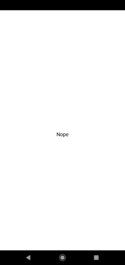
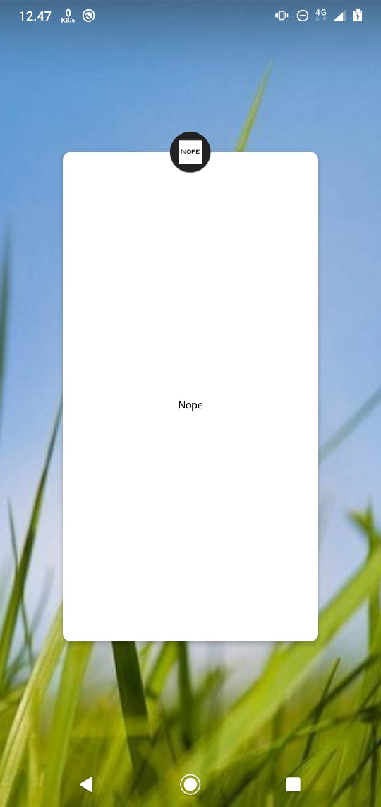

# Nope
An Android Application, Where it's README has more content than the actual app.

## Usage
Just launch the app, and Nope.

## Feature
- Night Day Cycle
- Supports Android 1.0! **literally!**
- Small APK size!
    - 9kB for Release
    - 11kB for Debug
- Fast App Launch! <sup>[1]</sup>
    - Nokia 6.1 Plus : 8ms
    - AVD Android Emulator API 29 : 17ms <sup>[2]</sup>
    - Android-x86 : 4 ms <sup>[2]</sup>

<sub>[1] Measured from before launcher's `startActivity` to debug app's `onCreate` block end (possibly includes IO overhead and time drifts)</sub><br/><sub>[2] PC Spec : Intel Core i7 6700 @3.4GHz, 16GB DDR4 RAM, GTX 1060 6GB</sub>

## Intent of creation
I created this app as a pad for [Tincore Keymapper](https://play.google.com/store/apps/details?id=com.tincore.and.keymapper&hl=en) Net to control my Android-x86 from my phone. Where Tincore is only receiving where the touchpoint is and sending it to target but is not preventing it from getting received by the view underneath.

And then I think, why not push it's simplicity further? So I made this project as Android 1.0 compatible project.

#### Why is it so small?
You know, Android 1.0 has less API than later version. And also, I used Java instead of Kotlin, Saving several hundreds kB from my built APK, without any library (including compatibility 'appcompat' library). The icons are also just two 1 bit 32x32 PNG (165+233 byte only!)

This app is very simple, Anyone can make it.

### Influenced by
- [Nothing](https://play.google.com/store/apps/details?id=com.gorro.nothing&hl=in&gl=US), Android 4.1, 14MB, But it has secrets and more letters!, Which literally is not really nothing.
- [Nothing Lite](https://play.google.com/store/apps/details?id=com.asurya.nothinglite&hl=en_US&gl=US), Android 4.0.3, 826kB, Lite version of Nothing made by other developer.

### Screenshots



## License
Also, Nope (I mean, Unlicense)
````
This is free and unencumbered software released into the public domain.

Anyone is free to copy, modify, publish, use, compile, sell, or
distribute this software, either in source code form or as a compiled
binary, for any purpose, commercial or non-commercial, and by any
means.

In jurisdictions that recognize copyright laws, the author or authors
of this software dedicate any and all copyright interest in the
software to the public domain. We make this dedication for the benefit
of the public at large and to the detriment of our heirs and
successors. We intend this dedication to be an overt act of
relinquishment in perpetuity of all present and future rights to this
software under copyright law.

THE SOFTWARE IS PROVIDED "AS IS", WITHOUT WARRANTY OF ANY KIND,
EXPRESS OR IMPLIED, INCLUDING BUT NOT LIMITED TO THE WARRANTIES OF
MERCHANTABILITY, FITNESS FOR A PARTICULAR PURPOSE AND NONINFRINGEMENT.
IN NO EVENT SHALL THE AUTHORS BE LIABLE FOR ANY CLAIM, DAMAGES OR
OTHER LIABILITY, WHETHER IN AN ACTION OF CONTRACT, TORT OR OTHERWISE,
ARISING FROM, OUT OF OR IN CONNECTION WITH THE SOFTWARE OR THE USE OR
OTHER DEALINGS IN THE SOFTWARE.

For more information, please refer to <http://unlicense.org/>
````
